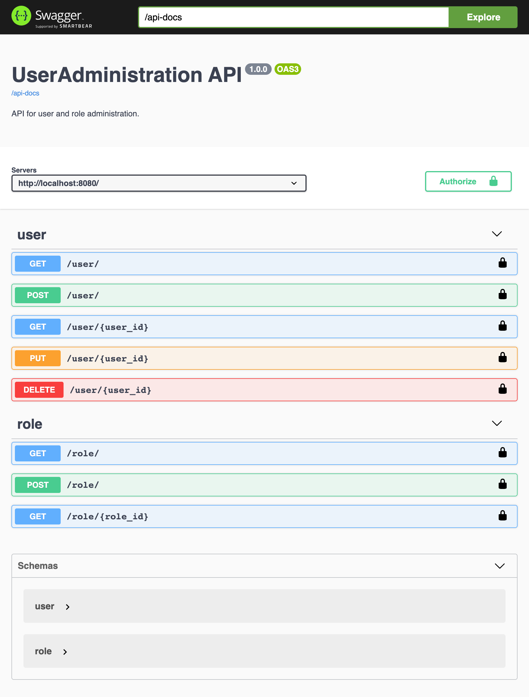

# userAdministration

## Table of Contents
1. [General Info](#general-info)
2. [Technologies](#technologies)
3. [Installation](#installation)

### General Info

This server was generated by the [swagger-codegen](https://github.com/swagger-api/swagger-codegen) project.  
By using the [OpenAPI-Spec](https://github.com/OAI/OpenAPI-Specification) from a remote server, you can easily generate a server stub.
This Node project is for the creation of an API for user and role management.

### Screenshot


## Technologies
***
A list of technologies used within the project:
* [Node.js](https://nodejs.org/de/): Version 18.4.0
* [Express.js](https://expressjs.com/de/): Version 4.18.2
* [swagger-ui-express](https://www.npmjs.com/package/swagger-ui-express): Version 4.6.1

## Installation
***
A little intro about the installation.
```
$ git clone https://github.com/LuciaFeddersen/UserAdministrationServer.git
$ npm install
$ node index.js
```

### Running the server
To run the server, run:

```
node index.js
```

To view the Swagger UI interface:

```
open http://localhost:8080/docs
```
